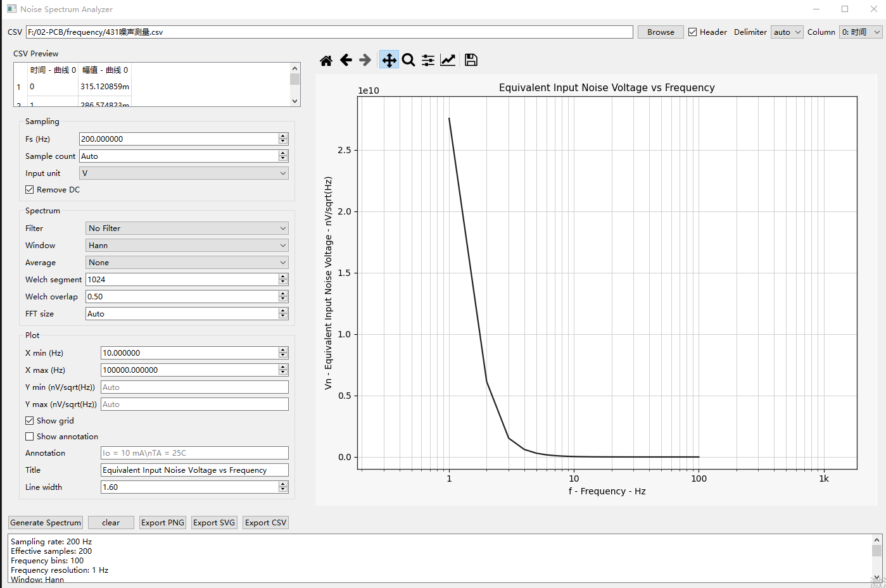

# Noise Spectrum App

Python GUI tool for converting time-domain noise samples in CSV to ASD spectrum (`nV/sqrt(Hz)`).

## Features (MVP)

- CSV preview and column selection
- Sampling / FFT / Welch parameter configuration
- Remove DC + window selection
- Welch PSD estimation
- ASD conversion to `nV/sqrt(Hz)`
- Manual-style plot style (log-frequency axis)
- Export PNG / SVG / CSV

## Quick Start

```bash
pip install -r requirements.txt
python -m app.main
```

Run from project root:

```text
noise_spectrum_app/
```

## Notes

- Supported input units: `V`, `mV`, `uV`, `nV`.
- Current filter mode supports only `No Filter` (other filter items are reserved).

## Screenshot

Software running screenshot:


